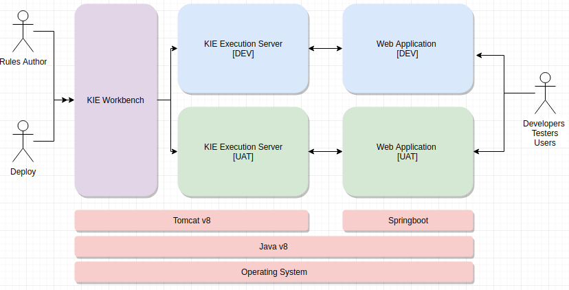

# kie-work bencha and Server on-tomcat

## Introduction
This guide is prepared for Proof of Concept for KIE Workbench, KIE Execution Server installation and
configuration on Java v8 and Tomcat v9 or v8. This guide provides step by step instructions to prove the
below concept.
- A centralized KIE Workbench to author the rules
- Deploy changes to target Kie Execution Server for Rules Execution
- Call Authored Rules from a Sample Springboot and retrieve the Rule Results using REST API

Please refer Section#3 Context of Proof Of Context for more details

## Environment Details
- KIE Drools Workbench 7.11.0_Final
- KIE Server 7.11.0_Final
- Tomcat v8 or v9
- Java v8
- Ubuntu/Linus/Windows
- Maven

## Refer KIE_On_Tomcat_Install_and_Config_Guide.pdf
for Full installation and configuration details
